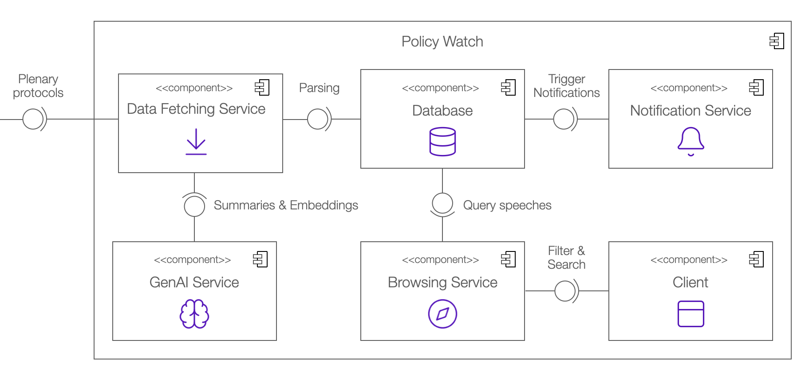

[](https://rest-in-peace.student.k8s.aet.cit.tum.de)
[](LICENSE)
[](https://github.com/AET-DevOps25/team-rest-in-peace/issues)

[](https://rest-in-peace.student.k8s.aet.cit.tum.de)

## Local Setup

### Prerequisites

- Docker and Docker Compose installed on your machine
- Git to clone the repository

### Setup Steps

1. **Clone the repository:**
   ```bash
   git clone <repository-url>
   cd team-rest-in-peace
   ```

2. **Create a `.env` file in the root directory:**
   ```bash
   cp .env.template .env
   ```

   Then edit the `.env` file and configure the following environment variables:
   ```
   POSTGRES_PASSWORD
   DF_BUNDESTAG_API_KEY (-> https://dip.bundestag.de/%C3%BCber-dip/hilfe/api)
   DF_DB_PASSWORD
   NLP_DB_PASSWORD
   NLP_GENAI_API_KEY (-> Gemini-API-Key)
   BS_DB_PASSWORD
   NS_MAIL_PASSWORD (-> Google App PW)
   ```

3. **Build and start the services:**
   ```bash
   docker compose up --build
   ```

4. **Access the application:**
   - The client application will be available at http://localhost:80
   - Grafana dashboard will be available at http://localhost:9091
   - OpenAPI documentation (SwaggerUI) will be available at http://localhost:80/docs

## AWS Deployment

### Prerequisites

- AWS CLI installed and configured
- Terraform installed
- Ansible installed
- SSH key for accessing EC2 instances

### Setup Steps

1. **Configure AWS credentials:**
   ```bash
   aws configure
   ```

   Alternatively, ensure your AWS credentials are set up in `~/.aws/credentials`:
   ```
   [default]
   aws_access_key_id=YOUR_ACCESS_KEY
   aws_secret_access_key=YOUR_SECRET_KEY
   ```

2. **Create a `.env` file** in the root directory as described in the Local Setup section.

3. **Deploy the infrastructure using Terraform:**
   ```bash
   cd terraform
   terraform init
   terraform apply -auto-approve
   cd ..
   ```

4. **Create a new .env.aws file:**
   ```bash
   NEW_URL=$(sed -n '2p' ansible/inventory.ini | sed 's/^/http:\/\//; s/$/\//')
   sed "s|^CLIENT_BASE_URL=.*|CLIENT_BASE_URL=${NEW_URL}|" .env > .env.aws
   ```

5. **Deploy the application using Ansible:**
   - Replace `[SSH_PKEY_PATH]` with the path to your SSH private key for AWS (e.g., `~/.ssh/labuser.pem`).
   ```bash
   cd ansible
   ansible-playbook --private-key=[SSH_PKEY_PATH] playbook.yml
   cd ..
   ```

6. **Access the application:**
   - The application will be available at the IP address listed in `ansible/inventory.ini`
   - You can view the IP with:
   ```bash
   source <(grep '^CLIENT_BASE_URL=' .env.aws)
   echo "${CLIENT_BASE_URL}"
   ```

## Monitoring

To monitor the system locally:

- **Grafana** is available at [http://localhost:9091](http://localhost:9091)  
- (**Prometheus** is available at [http://localhost:9090](http://localhost:9090))

### Dashboards

- **SpringBoot RIP Dashboard** – Monitors the three Spring Boot applications  
- **FastAPI RIP Dashboard** – Monitors the GenAI FastAPI service  

> **Tip:** When testing locally, set the Grafana time window to the **last 5 minutes** for the most relevant metrics.

### Alerts

1. **High CPU Usage (> 80%)** – Triggered when any Spring Boot service exceeds 80% CPU usage.  
2. **HTTP 5xx Responses** – Triggered when an instance returns a 5xx (server error) HTTP status code.

### Known Limitation

Due to time constraints, we created two separate dashboards instead of consolidating metrics from both systems into a unified view.


## CI / CD Pipeline Components

[](https://github.com/AET-DevOps25/team-rest-in-peace/actions/workflows/build_docker_images.yml)

**Build Docker Images** - Automatically builds and pushes Docker images for all services to GitHub Container Registry when code is pushed to the main branch.

[](https://github.com/AET-DevOps25/team-rest-in-peace/actions/workflows/ci_browsing_service.yml)

**CI for Browsing Service** - Runs linting and testing for the Java-based browsing service using Gradle whenever changes are made to the browsing-service directory.

[](https://github.com/AET-DevOps25/team-rest-in-peace/actions/workflows/ci_client.yml)

**CI for Client** - Validates the frontend client by running linting and tests using Node.js and npm when client code changes.

[](https://github.com/AET-DevOps25/team-rest-in-peace/actions/workflows/ci_data_fetching_service.yml)

**CI for Data Fetching Service** - Performs quality checks and testing for the Java-based data fetching service using Gradle on pull requests.

[](https://github.com/AET-DevOps25/team-rest-in-peace/actions/workflows/ci_genai_service.yml)

**CI for Genai Service** - Runs Python code formatting checks with Black and executes tests using pytest for the AI/GenAI service.

[](https://github.com/AET-DevOps25/team-rest-in-peace/actions/workflows/ci_notification_service.yml)

**CI for Notification Service** - Validates the Java-based notification service through Gradle linting and testing on code changes.

[](https://github.com/AET-DevOps25/team-rest-in-peace/actions/workflows/deploy_to_aws.yml)

**Deploy to AWS** - Automatically deploys the application to EC2 using Docker Compose, copying configuration files and starting containers on the target instance.

[](https://github.com/AET-DevOps25/team-rest-in-peace/actions/workflows/deploy_to_k8s.yml)

**Deploy to K8s** - Deploys the application to Kubernetes using Helm charts after successful Docker image builds, managing configuration and secrets injection.

## Diagrams

<figure>
  
  <figcaption>Component Diagram</figcaption>
</figure>

<figure>
  
  <figcaption>Use Case Diagram</figcaption>
</figure>

<figure>
  
  <figcaption>Database Diagram</figcaption>
</figure>

<figure>
  
  <figcaption>Analysis Object Model</figcaption>
</figure>


